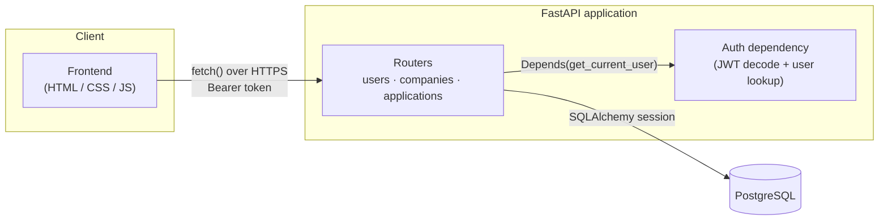
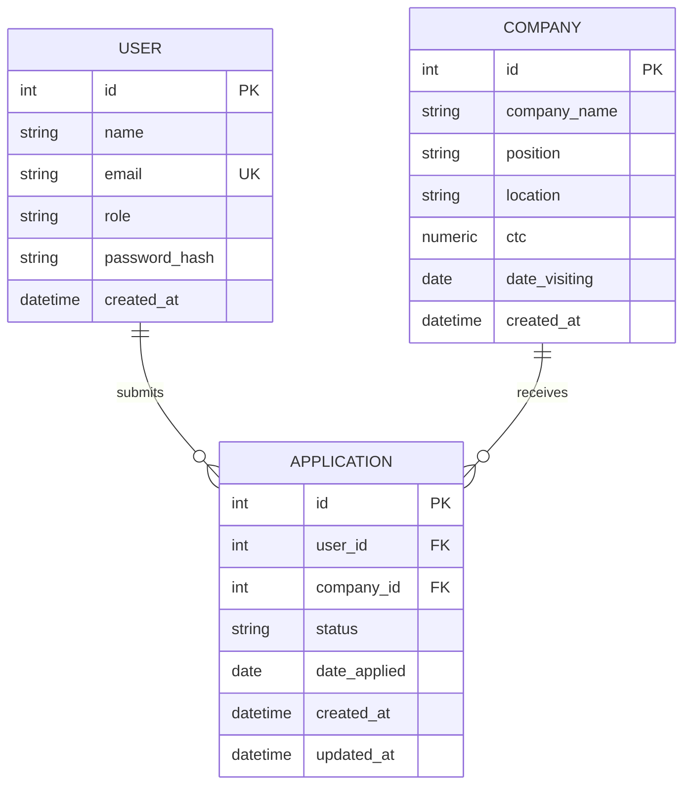
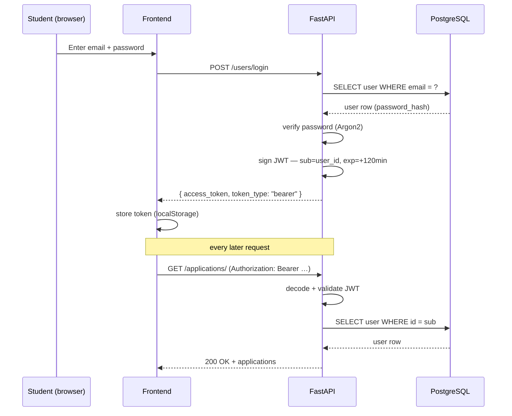

# Placement Tracker

A REST API and lightweight frontend for tracking campus-placement applications —
students log in, browse companies visiting for a drive, apply, and track each
application through its lifecycle.

Built to practice a proper FastAPI backend: typed SQLAlchemy models, Pydantic
schemas kept separate from the ORM layer, JWT-based auth, Alembic migrations,
and a small vanilla-JS frontend consuming the API over REST.

## Tech stack

| Layer          | Choice                                   |
|----------------|-------------------------------------------|
| API framework  | FastAPI                                   |
| ORM            | SQLAlchemy 2.0 (typed `Mapped[...]` models) |
| Database       | PostgreSQL                                |
| Migrations     | Alembic                                   |
| Auth           | JWT (PyJWT), Argon2 password hashing (pwdlib) |
| Frontend       | Plain HTML / CSS / JS, no build step      |

## Architecture



The frontend never talks to the database directly — every read and write goes
through the API, and every route except registration, login, and the public
company list requires a valid bearer token.

## Data model



A unique constraint on `(user_id, company_id)` stops the same student applying
to the same company twice; a unique constraint on
`(company_name, location, position, ctc)` stops the same drive being filed
twice.

## Auth flow



Tokens are short-lived (120 minutes) and stateless — there's no server-side
session or refresh-token flow yet, which is a deliberate scope cut for v1,
not an oversight.

## API reference

| Method | Path                     | Auth required | Purpose                          |
|--------|--------------------------|:--------------:|-----------------------------------|
| POST   | `/users/`                | –              | Register                          |
| POST   | `/users/login`           | –              | Log in, get a JWT                 |
| GET    | `/users/me`              | ✓              | Current user's profile            |
| GET    | `/companies/`            | –              | List all companies visiting       |
| POST   | `/companies/`            | ✓              | File a new drive                  |
| GET    | `/companies/{id}`        | –              | Company detail                    |
| DELETE | `/companies/{id}`        | ✓ (admin)      | Remove a company                  |
| POST   | `/applications/`         | ✓              | Apply to a company                |
| GET    | `/applications/`         | ✓              | List *your* applications          |
| GET    | `/applications/{id}`     | ✓              | One application's detail           |
| PATCH  | `/applications/{id}`     | ✓              | Update application status         |
| DELETE | `/applications/{id}`     | ✓              | Withdraw an application            |

## Running it locally

```bash
# backend
cd app/..
pip install -r requirements.txt
cp .env.example .env   # fill in your own DB name/user/password + JWT secret
alembic upgrade head
uvicorn app.app:app --reload

# frontend, from the frontend/ folder
python -m http.server 5500
```

Open `http://localhost:5500`. See `frontend/README.md` for details, and
`DEPLOYMENT.md` for putting this somewhere public.

## Roadmap

Tracked from the original requirements doc, not yet built:

- Return `role` from `/users/me` so the frontend can hide admin-only actions
  instead of just surfacing the backend's 403.
- Promote `position` from a string field on `Company` into its own entity
  (one company can offer several roles).
- Extra application statuses: `SHORTLISTED`, `INTERVIEW`, `WITHDRAWN`.
- Tests (pytest + a test database) and a CI workflow.
- Dockerize both services.
